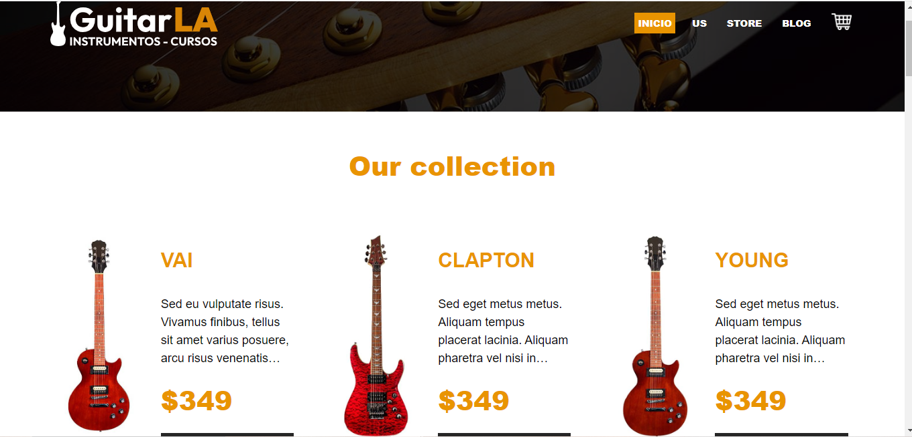

<div align="center">
  
  <h3><b>GuitarLA - Remix</b></h3>

  

  <br/>

  

</div>

# 📗 Table of Contents <a name="table-of-contents"></a>

- [📗 Table of Contents](#-table-of-contents-)
- [📖 About the Project](#-about-the-project-)
  - [🚀 Live Demo ](#-live-demo-)
  - [🛠 Built With](#-built-with-)
    - [Tech Stack](#tech-stack-)
    - [Key Features](#key-features-)
  - [🚀 Getting Started](#-getting-started-)
    - [Prerequisites](#prerequisites)
    - [Setup](#setup)
    - [Install](#install)
    - [Usage](#usage)
  - [👥 Authors](#-authors-)
  - [🤝 Contributing](#-contributing-)
  - [📝 License](#-license-)

<!-- PROJECT DESCRIPTION -->

# 📖 About the Project <a name="about-project"></a>

**Online Guitar Store** This web application is an online store for purchasing guitars. It's built using Remix on the front-end and Strapi on the back-end. The project focuses on providing a seamless user experience with dynamic routes, a shopping cart system, a blog, and efficient media handling with Cloudinary. Additionally, it utilizes a PostgreSQL database for robust product management.

🎸 This app was created as part of the course "React - The Complete Guide: Hooks Context Redux MERN +15 Apps"! 


<!-- LIVE DEMO -->

## 🚀 Live Demo <a name="live-demo"></a>

- [Live Demo](https://guitarla-remix-lyart.vercel.app/)


<p align="right">(<a href="#readme-top">back to top</a>)</p>

## 🛠 Built With <a name="built-with"></a>

### Tech Stack <a name="tech-stack"></a>

<details>
  <summary>Front-end</summary>
  <ul>
    <li><a href="https://remix.run/docs">Remix</a></li>
  </ul>
</details>

<details>
  <summary>Back-end</summary>
  <ul>
    <li><a href="https://strapi.io/">Strapi</a></li>
    <li>PostgreSQL</li>
  </ul>
</details>

# 🚀 Getting Started <a name="getting-started"></a>

To get a local copy up and running, follow these steps.

### Setup

1. Clone this repository to your desired folder:

```sh
git https://github.com/cilfonegabriel/guitarla-remix.git
cd guitarla-remix


### Install

After cloning the repo, navigate into it and install all the required packages with the following command:

```sh

npm install


```

Then just wait for everything to finish downloading.

### Usage

Start the React app:

`npm run dev`

Runs the app in the development mode.\
Open [http://localhost:3000](http://localhost:3000) to view it in your browser.

The page will reload when you make changes.\
You may also see any lint errors in the console.

`npm run eject`


### Deployment

You can deploy this project using:

`npm run build`

Builds the app for production to the `build` folder.\
It correctly bundles React in production mode and optimizes the build for the best performance.

The build is minified and the filenames include the hashes.\
Your app is ready to be deployed!

See the section about [deployment](https://facebook.github.io/create-react-app/docs/deployment) for more information.

<p align="right">(<a href="#readme-top">back to top</a>)</p>

<!-- AUTHORS -->

## 👥 Authors <a name="authors"></a>

👤 **Gabriel -Cilfone**
- GitHub: [Gabriel Cilfone](https://github.com/cilfonegabriel)
- LinkedIn: [Gabriel Cilfone](www.linkedin.com/in/gabriel-cilfone/)

<p align="right">(<a href="#readme-top">back to top</a>)</p>

<!-- FUTURE FEATURES -->

## 🔭 Future Features <a name="future-features"></a>

- [ ] **Enhance About Us pages**
- [ ] **Implement user authentication**
- [ ] **Optimize SEO practices**
- [ ] **Add advanced search functionality**

<p align="right">(<a href="#readme-top">back to top</a>)</p>

<!-- CONTRIBUTING -->

## 🤝 Contributing <a name="contributing"></a>

Contributions, issues, and feature requests are welcome!

Feel free to check the [issues page](https://github.com/cilfonegabriel/guitarla-remix/issues).

<p align="right">(<a href="#readme-top">back to top</a>)</p>

<!-- SUPPORT -->

<p align="right">(<a href="#readme-top">back to top</a>)</p>

<!-- ACKNOWLEDGEMENTS -->

## 🙏 Acknowledgments <a name="acknowledgements"></a>

- Thanks to Microverse and all my teammates!

<p align="right">(<a href="#readme-top">back to top</a>)</p>

## 📝 License <a name="license"></a>

This project is [MIT](./LICENSE) licensed.

<p align="right">(<a href="#readme-top">back to top</a>)</p>